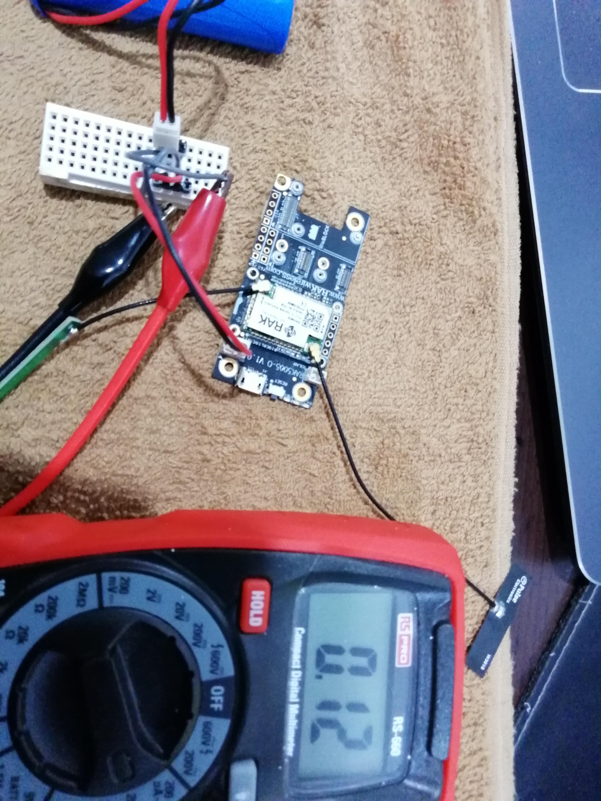
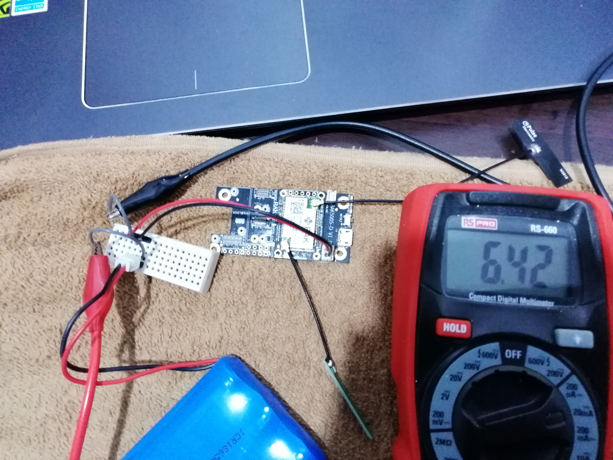

# RAK4631-DeepSleep
Example code that shows how to minimize the power consumption of the WisBlock Core RAK4631 while using LoRa P2P (device to device) communication.

# This is not using LoRaWAN!

The code is made for Arduino IDE and PlatformIO and available in the corresponding folders.  
  
There are two options for the code.  
- Transmitting frequently only
- Listen to incoming messages and transmitting frequently.

To switch between the two modes, look into **`lora.cpp`**.     
Enabling `#define TX_ONLY` selects TX only mode. Commenting that line selects RX/TX mode.    

# Keep in mind this does not any sensor readings. It is just sending a 14 bytes package every 10 seconds.

In the transmit only mode, a power consumption of 120uA (while sleeping) could be achieved:

In receive/transmit mode the SX1262 RxDutyCycle feature is used. In this mode, the SX126x chip is in low power mode most of the time, only listing in specified time intervals for packets.    
Depending on how many other node are sending on the same frequency, the power consumption changes, but I could achieve a 6mA consumption with 4 other nodes around that send data every 10 seconds on the same frequency.     
     
More information about RxDutyCycle and hwo to calculate sleep and listen times can be found in Semtech's documentation [SX1261_AN1200.36_SX1261-2_RxDutyCycle_V1.0](https://semtech.my.salesforce.com/sfc/p/#E0000000JelG/a/2R0000001O3w/zsdHpRveb0_jlgJEedwalzsBaBnALfRq_MnJ25M_wtI)

